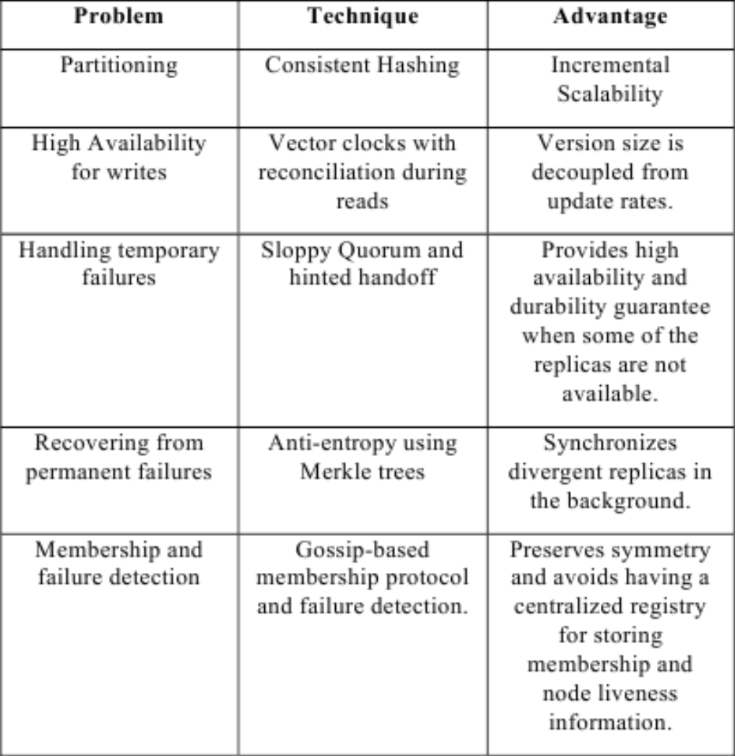

# Day 11 (2/13/2025)

## Dynamo DB Design

## System Interface

2 operations

1. put(key, context, object)
    - key = primary key associated w object
    - context = vector clocks / history (for merging)
    - object = data to store

2. get(key)
    - locates object replicas
    - returns single object or list of object w conflicting versions

## Data Partitioning

- Use consistent hashing
  - ring of nodes
- use virtual nodes
  - each physical node has multiple virtual nodes

## Replication

- store multiple copies of data on different nodes (maybe neighbors)

## Data Versioning

- using lamport clocks, we can determine timing of events

## Consistency (execution of get, put)

- coordinator node (handles read / write) among top N in preference list
- coordinator runs a r/w quorum system
- use a weighted voting system (some nodes have higher weight for vote)
  - each request (get/put) has a required amount of votes before the end user can have confirmation of success
  - when client sends to server, server wont reply until it has gotten enough votes to confirm it (# votes = arbitrary)
  - each node has arbitrary # of votes

## Membership / Failure Detection (Merkle Tree)

- used for copying data
- kept in logs
