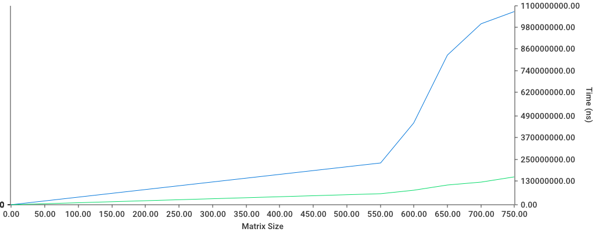

# CPE 469 Lab 1 – (1/15/2025) Ben Soto, Avery White

## The Program

The task was to create a matrix multiplication algorithm that utilizes goroutines and benchmarking it compared to a sequential matrix multiplication algorithm.

The program will perform matrix multiplication on a random matrix of 64-bit floats with a size provided by the `size` variable in the main function. It will time the execution of the sequential and the distributed version and print them to the terminal.

There is also functionality to run multiple tests and generate a pdf depicting a graph of the execution time for the two versions of the algorithm. To use this, vary the `amount`, `increment`, and `start` parameters.

`amount` = how many runs you would like to perform

`increment` = how much larger you want your matrix to be compared to previous value

`start` = what size matrix to begin with

Additionally, a file will be created called `output.png` that displays a graph of the test ran.

## How to Use

1) Navigate to the matmul directory
2) execute 'go run matmul.go' through CLI
    1) (The default/starting value is a single run with size 1000)

Additionallty, if you want to change the size of the matricies or increase the amount of tests, vary the three variables listed above.

## Examples

### 1.

    amount := 1
    increment := 0
    start := 1000

Output:

    run: 1 size: 1000
    sequential done: 3.271217584s
    distributed done: 511.869625ms
    check?:  true

    Done.

### 2.

    amount := 5
    increment := 50
    start := 500

Output:

    run: 1 size: 550
    sequential done: 230.645667ms
    distributed done: 60.762375ms
    check?:  true

    run: 2 size: 600
    sequential done: 452.115667ms
    distributed done: 79.093625ms
    check?:  true

    run: 3 size: 650
    sequential done: 826.833583ms
    distributed done: 106.613959ms
    check?:  true

    run: 4 size: 700
    sequential done: 998.667958ms
    distributed done: 124.233666ms
    check?:  true

    run: 5 size: 750
    sequential done: 1.066522375s
    distributed done: 153.533125ms
    check?:  true

    Done.

